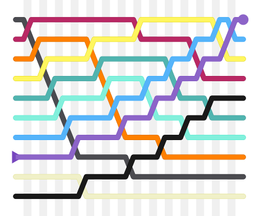
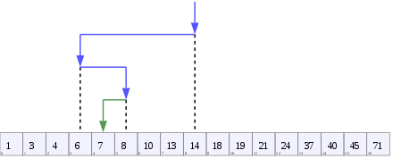

# Welcome to RobinXYuan Python Algorithm Notes

## STACK

### Use Python to build stack

```python
class Stack:

    def __init__(self):
        self.items = []

    # Judge the stack is empty or not
    def isEmpty(self):
        return self.items == []

    # Add an item into the stack
    def push(self, item):
        self.items.append(item)

    # Delete the top item
    def pop(self):
        return self.items.pop()

    # Back to the top of the stack
    def peek(self):
        return self.items[len(self.items) - 1]

    # Get the size of the stack
    def size(self):
        return len(self.items)
```

### Usage of Stack

1. Parenthesis checker

In this example, stack is used to check if the parenthesis coupled or not

```python
from stackBasis.stack import Stack


def par_checker(symbolString):

    s = Stack()
    balanced = True
    index = 0

    while index < len(symbolString) and balanced:
        symbol = symbolString[index]

        if symbol == "(":
            s.push(symbol)
        else:
            if s.isEmpty():
                balanced = False
            else:
                s.pop()

        index += 1

    if balanced and s.isEmpty():
        return True
    else:
        return False
```

An improved version

```python
from stackBasis.stack import Stack


def par_checker(symbolString):
    s = Stack()
    balanced = True
    index = 0
    while index < len(symbolString) and balanced:
        symbol = symbolString[index]
        if symbol in "([{":
            s.push(symbol)
        else:
            if s.isEmpty():
                balanced = False
            else:
                top = s.pop()
                if not matches(top, symbol):
                       balanced = False
        index += 1

    if balanced and s.isEmpty():
        return True
    else:
        return False


def matches(open,close):
    opens = "([{"
    closers = ")]}"
    return opens.index(open) == closers.index(close)
```

2. Convert decimal numbers to another formats

In this example, a converter is built for converting decimal numbers to another formats

- param1 -- A decimal number
- param2 -- The format you want to convert to

```python
from stackBasis.stack import Stack


def converter(dec_num, base):

    digits = "0123456789ABCDEF"

    stack = Stack()

    while dec_num > 0:
        rem = dec_num % base
        stack.push(rem)
        dec_num = dec_num // base

    result_string = ""

    while not stack.isEmpty():
        result_string = result_string + digits[stack.pop()]

    return result_string


print(converter(25, 2))
print(converter(334, 16))
```

## QUEUE

### Use Python to build a queue

```python


class Queue():

    def __init__(self):
        self.items = []

    def isEmpty(self):
        return self.items == []

    def enqueue(self, item):
        self.items.insert(0, item)

    def dequeue(self):
        return self.items.pop()

    def size(self):
        return len(self.items)
```

### A simple example of queue usage

This example is a simulation of *Hot Potato* game.

The *Hot Potato* is a game that several people sit in a circle, and they transmit a potato one by one 
in a specific time, and the last people who takes the potato will be out. 

```python
from queueBasis.queue import Queue


def hot_potato(list, num):

    queue = Queue()

    for name in list:
        queue.enqueue(name)

    while queue.size() > 1:
        for i in range(num):
            queue.enqueue(queue.dequeue())

        queue.dequeue()

    return queue.dequeue()


print(hot_potato(["Bill", "David", "Susan", "Jane", "Kent", "Brad"], 7))
```

## DEQUEUE

Dequeue is a double head queue.

### Use Python to build a dequeue

```python
class Dequeue():
    def __init__(self):
        self.items = []

    def isEmpty(self):
        return self.items == []

    def addFront(self, item):
        self.items.append(item)

    def addRear(self, item):
        self.items.insert(0, item)

    def removeFront(self):
        return self.items.pop()

    def removeRear(self):
        return self.items.pop(0)

    def size(self):
        return len(self.items)
```

### Palindrome checker use Python

 ```python
from queueBasis.dequeue import Dequeue


def palchecker(text):
    deque = Dequeue()

    for char in text:
        deque.addRear(char)

    equal = True

    while deque.size() > 1 and equal:
        first = deque.removeFront()
        last = deque.removeRear()

        if first != last:
            equal = False

    return equal


print(palchecker("lsdkjfskf"))
print(palchecker("radar"))
```

## SORT

### Insertion Sort


```python
from time import time


def insertion_sort(A):
    for j in range(2, len(A)):
        key = A[j]
        i = j - 1
        while (i >= 0) and (A[i] > key):
            A[i+1] = A[i]
            i = i - 1
        A[i+1] = key


if __name__ == '__main__':
    LIST = [1, 5, 8, 123, 22, 54, 7, 99, 300, 222]
    start = time()
    insertion_sort(LIST)
    stop = time()
    print(LIST)
    print(str(stop - start) + "second")
```

### Bubble Sort




```python
from time import time


def bubble_sort(A):
    n = len(A)
    for i in range(0, n):
        for j in range(i+1, n):
            if A[i] > A[j]:
                A[i], A[j] = A[j], A[i]
    return A


if __name__ == '__main__':
    LIST = [1, 5, 8, 123, 22, 54, 7, 99, 300, 222]
    start = time()
    bubble_sort(LIST)
    stop = time()
    print(LIST)
    print(str(stop - start) + "second")
```

### Shell Sort


```python
from time import time


def shell_sort(A):
    count = len(A)
    # Initial gap
    inc = round(count / 2)
    while inc > 0:
        for i in range(inc, count-1):
            # For every gap, do the insertion sort
            temp = A[i]
            j = i
            while (j >= inc) and (A[j - inc] > temp):
                A[j] = A[j - inc]
                j = j - inc
            A[j] = temp
        # Get new gap
        inc = round(inc / 2)

    return A


if __name__ == '__main__':
    LIST = [1, 5, 8, 123, 22, 54, 7, 99, 300, 222]
    start = time()
    shell_sort(LIST)
    stop = time()
    print(LIST)
    print(str(stop - start) + " second")
```

## SEARCH

### Sequential Search

```python


def squential_search(list, item):

    pos = 0
    found = False

    length = len(list)

    while pos < length and not found:
        if list[pos] == item:
            found = True
        else:
            pos += 1

    return found


testlist = [1, 2, 32, 8, 17, 19, 42, 13, 0]
print(squential_search(testlist, 3))
print(squential_search(testlist, 13))
```

### Binary Search



```python


def binary_search(list, item):

    first_item = 0
    last_item = len(list) - 1

    found = False

    while first_item <= last_item and not found:
        mid_item = (first_item + last_item) // 2

        if list[mid_item] == item:
            found = True
        else:
            if item < list[mid_item]:
                last_item = mid_item - 1
            else:
                first_item = mid_item + 1

    return found


testlist = [0, 1, 2, 8, 13, 17, 19, 32, 42]
print(binary_search(testlist, 3))
print(binary_search(testlist, 13))
```

## RECURSION

### Hanoi

```python
def hanoi(steps, left='left', middle='middle', right='right'):
    if steps:
        hanoi(steps - 1, left, right, middle)
        print(left, '=>', right)
        hanoi(steps - 1, middle, left, right)


hanoi(3)
```

